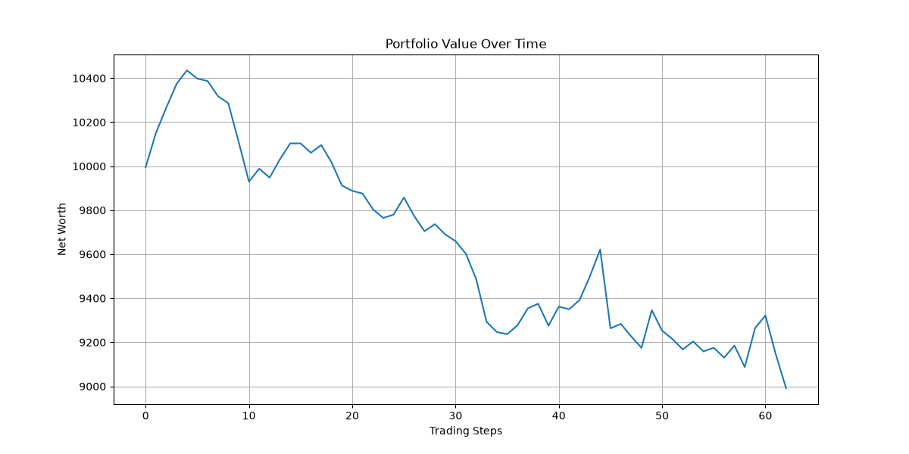
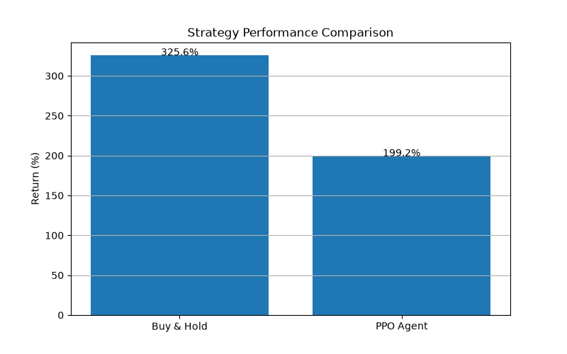

# TraderXRL

TraderXRL is a Reinforcement Learning based algorithmic trading system built using Python, Gymnasium, and Stable-Baselines3. The project trains a PPO (Proximal Policy Optimization) agent to make trading decisions using technical indicators and market data.

## Features

* Custom Gymnasium trading environment
* PPO reinforcement learning agent
* Technical indicators:

  * RSI
  * MACD
  * SMA20
  * SMA50
  * ATR
  * Bollinger Bands
  * Volatility
* Transaction fee simulation
* Backtesting framework
* Risk analysis
* Performance comparison with Buy & Hold strategy
* Equity curve visualization

## Project Structure

TraderXRL/
├── agents/
├── backtesting/
├── data/
├── env/
├── indicators/
├── models/
├── notebooks/
├── results/

## Performance

